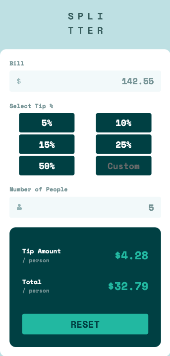

# Frontend Mentor - Tip calculator app solution

This is a solution to the [Tip calculator app challenge on Frontend Mentor](https://www.frontendmentor.io/challenges/tip-calculator-app-ugJNGbJUX). Frontend Mentor challenges help you improve your coding skills by building realistic projects.

## Table of contents

-   [Overview](#overview)
    -   [The challenge](#the-challenge)
    -   [Screenshot](#screenshot)
    -   [Links](#links)
-   [My process](#my-process)
    -   [Built with](#built-with)
    -   [What I learned](#what-i-learned)
-   [Author](#author)

**Note: Delete this note and update the table of contents based on what sections you keep.**

## Overview

### The challenge

Users should be able to:

-   View the optimal layout for the app depending on their device's screen size
-   See hover states for all interactive elements on the page
-   Calculate the correct tip and total cost of the bill per person

### Screenshot

Desktop

Mobile

### Links

-   Solution URL: [GitHub](https://github.com/dscorzoni/project-splitter)
-   Live Site URL: [GitHub Pages](https://dscorzoni.github.io/project-splitter)

## My process

### Built with

-   Semantic HTML5 markup
-   CSS custom properties
-   Flexbox
-   Mobile-first workflow
-   Vanilla Java Script

### What I learned

That was an interesting exercise to handle the business logic (tip calculation) while users are adding the inputs, so the result can be displayed instantaneously. To achieve that I had to be aware of dealing with default values for all inputs.

Also, an interesting part was styling and creating the functionality of the custom value, while having to handle a radio button dynamic for the other fixed tip percentage options.

## Author

-   Website - [Danilo Scorzoni Ré](https://www.github.com/dscorzoni)
-   Frontend Mentor - [@dscorzoni](https://www.frontendmentor.io/profile/dscorzoni)
-   LinkedIn - [@dscorzoni](https://www.linkedin.com/in/dscorzoni/)
